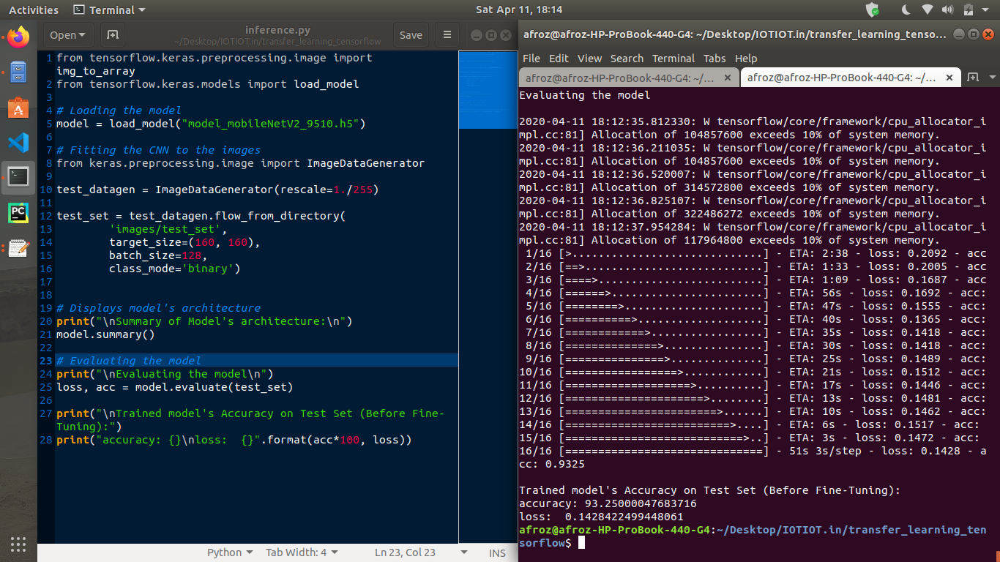
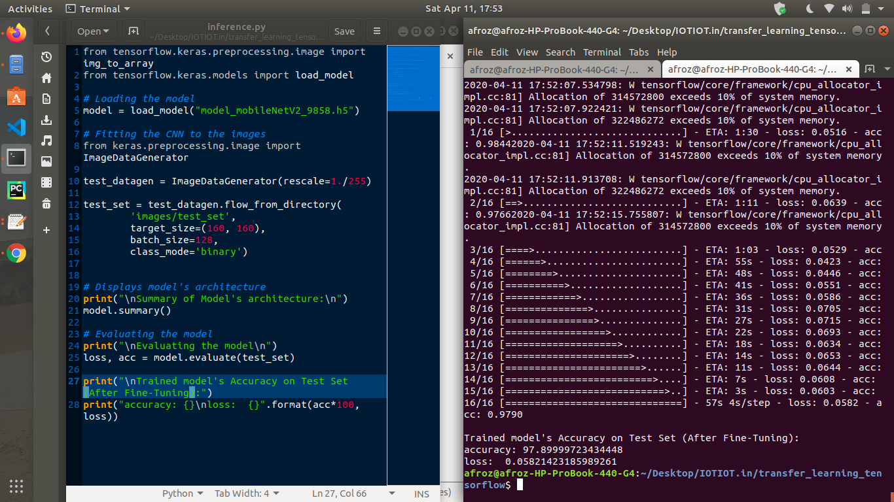

### Hyper-Parameter Summary (MobileNet v2)

#### Fine-Tuning
* The goal of fine-tuning is to adapt specialized features from a generic dataset to work with the new dataset, rather than overwrite the generic learning.
* Here I have trained (or "fine-tuned") the weights of the top layers of the pre-trained model.

#### Parameters to tune
* **Learning rate**: Choosing an **appropriate learning_rate helps improve the accuracy**. Here we have used **learning_rate = 0.0001**)
* **No. of epochs**: Increasing the no. of epochs upto which the model should train, can increase the accuracy of the model. Here we have trained the model again on 10 epochs (20 in total).
* **Unfreezing the top layers of the model** : We try and fine-tune a small number of top layers rather than the whole MobileNet model.

#### Un-freezing the top layers of the model
* First step is to unfreeze the ``base_model`` and set the bottom layers to be un-trainable.
* We then recompile the model (necessary for these changes to take effect), and resume training for 10 more epochs.
* Lastly we compile the model using a much lower learning rate (0.0001).
* After fine-tuning the model nearly reaches 98% accuracy.

```python
# Setting the top layers as trainable
base_mode.trainable = True

# To check how many layers are in the base model
print('Number of layers in the base model: ', len(base_model.layers))

# Fine-tune from this layer onwards 
fine_tune_at = 100

# Freeze all the layers before the `fine_tune_at` layer
for layer in base_model.layers[:fine_tune_at]:
    layer.trainable = False
    
# This step improves the accuracy of the model by a few steps
model.compile(loss=tf.keras.losses.BinaryCrossentropy(from_logits=True),
              optimizer = tf.keras.optimizers.RMSprop(lr=base_learning_rate/10),
              metrics=['accuracy'])
```

#### Fine Tuning the parameter weights
* To further improve performance, **we can repurpose the top-level layers of the pre-trained models to the new dataset via fine-tuning**. 
* In this case, **we tuned our weights such that our model learned high-level featuers specific to the dataset**. 
* This technique is usually recommended **when the training dataset is large** and **very similar to the original dataset that the pre-trained model was trained on**.

#### Results after Fine-Tuning the model
* Before fine-tuning the model, the model has an **accuracy of 93.25%** and **loss of 0.14 on the Test set**.
* After fine-tuning the model, the model has an **accuracy of 97.89%** and **loss of 0.058 on the Test set**.

#### Accuracy and Loss on Test set (Before Fine Tuning)


#### Accuaracy and Loss on Test set (After Fine Tuning)

