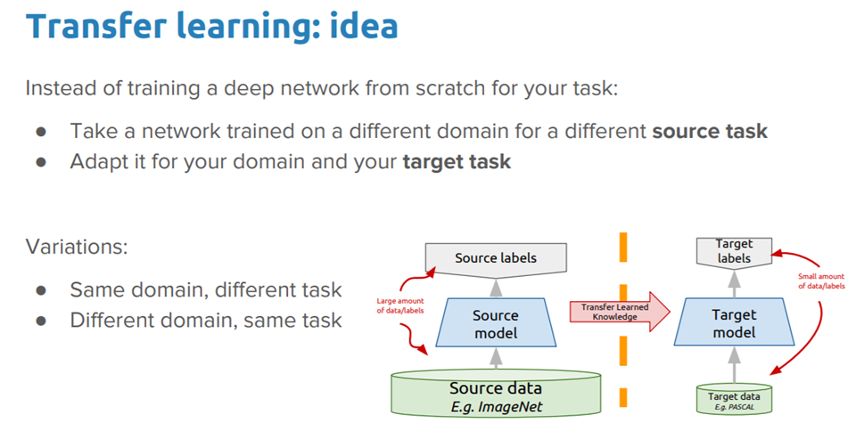

## Transfer Learning

### What is Transfer Learning ?
* In transfer learning, we **use a pre-trained model** which is trained on a large and general enough dataset to serve as a **generic model for our needs.**
* We can use these pre-trained models without having to train a model from scratch on a large dataset.

### Transfer learning in Tensorflow

#### Model used to perform transfer learning - MobileNet V2 
* It is a model developed at Google.
* It is trained on the ImageNet dataset, a large dataset of 1.4M images and 1000 classes. 

#### Using the “Bottleneck Layer” for Feature Extraction

* Here in the **cats_vs_dogs dataset** we use the very last layer before the flatten operation for feature extraction. This layer is called a **‘bottleneck layer’.**
* The bottleneck layer features retain more generality as compared to the final/top layer. 
* Here we set the include_top=False, so that **we load a model that doesn’t include the classification layers at the top.**

#### General Workflow for using a Pre-trained Model:
1. Examine and understand the data.
2. Build an input pipeline 
3. Compose
  a. Loading the pre-trained model and pre-trained weights.
  b. Stack the classification layers on top.
4. Train
5. Evaluate 

#### Advantages of using a pre-trained model for feature extraction:

* When working with a small dataset, we can **take advantage of features learned by a model trained on a larger dataset in the same domain.**
* This is done by **instantiating the pre-trained model and adding a fully-connected classifier on top.**
* The **pre-trained model is ‘frozen’** and **only the weights of the classifier get updated during training.**
* This in turn helps us achieve **better accuracy for our model**, even if we have a **small dataset and perform only fewer computations** for training.

### Accuracy and loss of model
* The model has a initial Accuracy of 0.54 and initial loss of 0.63 for the Validation set before training.
* After training the model on Train set, it has an accuracy of 0.9501 and loss of 0.1020.

**Link to Dockerfile:** https://hub.docker.com/repository/docker/afrozchakure/tl_tensorflow

